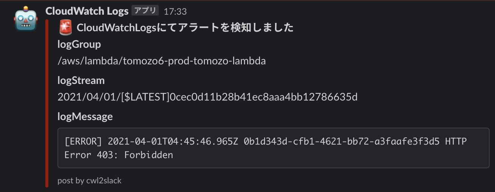

# cwl2slack

AWS CloudWatch Logs のロググループに Lambda サブスクリプションフィルターとして設定することで、
ログから指定した文字列を検知しログの内容を Slack に通知するLambdaです。

除外ワード(正規表現)を指定することで、ログを通知対象外にすることも可能です。

## 前提条件

### IAM Policy

AWSリソースを操作しないため IAM 権限は不要です。

## 詳細

### Event

サブスクリプションフィルタを介して Lambda に送信されるログは Base64 でエンコードされ gzip 形式で圧縮されています。

### Sample

```json
{
    "awslogs": {
        "data": "H4sIAAAAAAAAAFVQy07DMBD8lcji2BCv380tEmk5gEBtTlQVsmOnikjiyEmpoOq/Y6h64LizMzuzc0a9myZ9cNXX6FCOHoqqeH8ut9tiXaIF8qfBhQiDBMEoF0owiHDnD+vgj2PcZPo0ZZ3ujdXZ7Hv/7UU6Bm/T65BeV1fNdg5O91FEMIEMswxDtrt7KqpyW+1x7WpsAQxRhoGrldaaGQNEKiEot/HEdDRTHdpxbv2warvZhQnlO/TPtj51ZOp0/XFz3v9Zl59umH/ZZ9TamIAKLCSXhINURC6JxMAUqGjF8VIqDkC44EwJElEOSjKJOcMqppjbWNms+/g9CJCUcKUkXcrFrcp4flduNi+bffL7aIpZiqHCLGc8Z+J+Kfhbgg1YymjM2xhImYg0YyRJNW20bhxtqOXJY1W9JmUIPiQM0zxZ+WBaa92ALvvLD/9nNYO6AQAA"
    }
}
```

上記 json の data を gzip 解凍し Base64 デコードした値は以下となります。

```json
{
  "messageType": "DATA_MESSAGE",
  "owner": "171643568641",
  "logGroup": "/aws/lambda/tomozo6-prod-tomozo-lambda",
  "logStream": "2021/04/01/[$LATEST]0cec0d11b28b41ec8aaa4bb12786635d",
  "subscriptionFilters": [
    "tomozo6-prod-cwl2slack-lambda"
  ],
  "logEvents": [
    {
      "id": "36067572517827927014818866509785112565486281851874705408",
      "timestamp": 1617325887397,
      "message": "[ERROR] 2021-04-01T04:45:46.965Z 0b1d343d-cfb1-4621-bb72-a3faafe3f3d5 HTTP Error 403: Forbidden"
    }
  ]
}
```

### Returns

`null`

### Environment Variable

|Parameter|Description|Default|Required|
|:--|:--|:--|:--:|
|`SLACK_WEBHOOK_URL`|Slack通知先のIncoming Webhook URL|-|yes|
|`SLACK_CHANNEL`|Slack通知先のチャンネル。※publicチャンネルの必要があります|-|yes|
|`RE_EXCLUDE_WORD`|通知対象外にしたい文言(正規表現)|`None`|no|
|`FUNCTION_NAME`|Slack通知時にfooterとして表示されます。<br>`post by {FUNCTION_NAME}`|`cwl2slack`|no|

## Local Test

### 環境変数の設定

それぞれの環境に合わせて`docker-compose.yaml`の`environment`の修正し、`.env`ファイルを作成します。

### .envのSample

```conf
SLACK_WEBHOOK_URL=https://hooks.slack.com/services/xxxxxxxxx/xxxxxxxxxxx/xxxxxxxxxxxxxxxxxxxxxxxx
SLACK_CHANNEL=#alert-infra
RE_EXCLUDE_WORD='out'
```

### コンテナ起動

```bash
docker-compose up
```

### Request

```bash
# 上記 Event の Sample を用いてテストする場合
curl -XPOST "http://localhost:9000/2015-03-31/functions/function/invocations" -d '{"awslogs":{"data":"H4sIAAAAAAAAAFVQy07DMBD8lcji2BCv380tEmk5gEBtTlQVsmOnikjiyEmpoOq/Y6h64LizMzuzc0a9myZ9cNXX6FCOHoqqeH8ut9tiXaIF8qfBhQiDBMEoF0owiHDnD+vgj2PcZPo0ZZ3ujdXZ7Hv/7UU6Bm/T65BeV1fNdg5O91FEMIEMswxDtrt7KqpyW+1x7WpsAQxRhoGrldaaGQNEKiEot/HEdDRTHdpxbv2warvZhQnlO/TPtj51ZOp0/XFz3v9Zl59umH/ZZ9TamIAKLCSXhINURC6JxMAUqGjF8VIqDkC44EwJElEOSjKJOcMqppjbWNms+/g9CJCUcKUkXcrFrcp4flduNi+bffL7aIpZiqHCLGc8Z+J+Kfhbgg1YymjM2xhImYg0YyRJNW20bhxtqOXJY1W9JmUIPiQM0zxZ+WBaa92ALvvLD/9nNYO6AQAA"}}'
```

うまくいくと指定した Slack Channel に通知されます。


